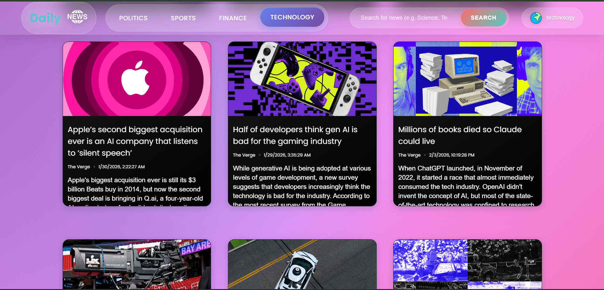

# 📰 Daily News App

A modern, responsive news app built with Vanilla JavaScript, delivering real-time news from around the world using NewsAPI.org.

## ✨ Features

- Real-time news from trusted sources
- Browse by category & country
- Search topics with suggestions
- Article preview modal & social sharing
- Responsive, PWA-ready, and fast loading

---

## 🛠️ Tech Stack

- HTML, CSS, Vanilla JavaScript
- NewsAPI.org
- Google Fonts, Unicode Icons

---

## 🔧 Setup

1. Clone the repo & install dependencies
2. Get API key from NewsAPI.org
3. Add key to script.js
4. Run with live server or deploy to GitHub Pages/Netlify/Vercel# News-App

---

<h2 align="center">📸 Project Preview</h2>

  

<h3>News-App</h3>
